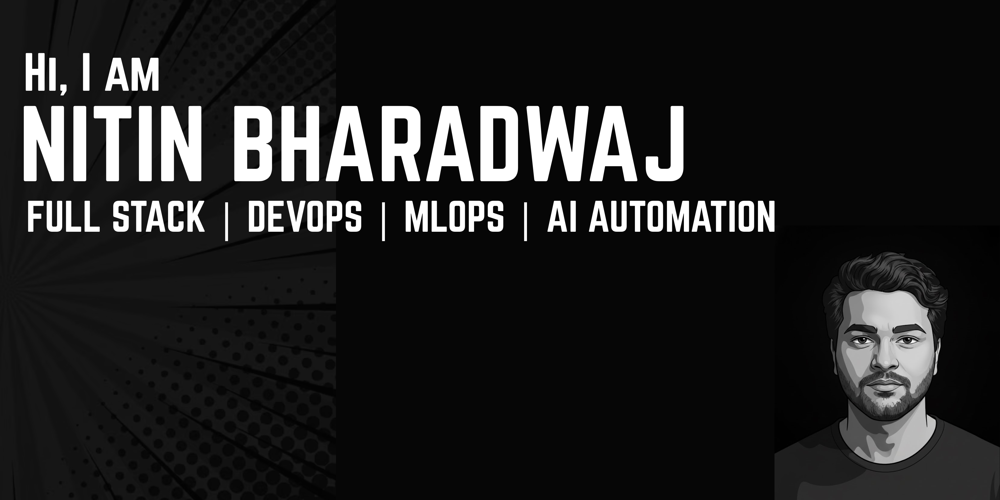

## Hi there 👋

<h1 align="center">Hi, I'm Nitin Bharadwaj 👋</h1>

  🔥 Full-Stack Developer | AI Automation | Next.js | TypeScript

---

## 🚀 About Me
- 🎓 MS Mathematics @ NIT Surat (National Institute Of Technology, Surat) 
- ⚙️ Worked on MentorMate, Car Wash Platform & Amage (AI photo filtering)  
- 🤖 Exploring AI automation workflows using LangChain & LangGraph  
- 🧠 Learning Postgres, Kafka, InfluxDB, and scalable backend systems  

---

## 🛠️ Tech Stack

### **Frontend**

---

### **Backend & APIs**

---

### **Databases & Streaming**

---

### **AI & Automation**

---

### **Tools**

---

##  Featured Projects

### 🔹 **MentorMate — Mentor/Mentee Platform**  
React (Vite) • MongoDB • Razorpay  
✔ Multi-role dashboards  
✔ Scheduling + Video calling  
✔ Secure payments

---

### 🔹 **CarWash — Location-Based Service App**  
Next.js • Google Maps API • Firebase  
✔ Real-time location picker  
✔ Google Sheets backend  
✔ Seamless booking flow

### 🔹 **ATPAC — Alumni Training & Placement Affairs Council, SVNIT**

✔ Official institutional website development
✔ Alumni engagement & placement information portal
✔ Structured information architecture
✔ Professional, responsive UI

### 🔹 **RIAC — Research & Innovation Affairs Council, SVNIT**

✔ Startup Expo digital management platform
✔ Contest registration & event handling system
✔ Interactive modules & engagement features
✔ Student–Professor innovation collaboration system

---

## 📊 GitHub Stats

---

## 📫 Contact Me
-  Email: **iitknitin06@gmail.com**
-  LinkedIn: https://www.linkedin.com/in/nitin-kumar-518528284/
-  Resume: https://drive.google.com/file/d/1TKEgdkdDha4utiRJnSv9rBTE3-fWRMyx/view
- 🌐 Portfolio: coming soon...

---

⭐ *Thanks for stopping by! Feel free to explore my projects.*  
